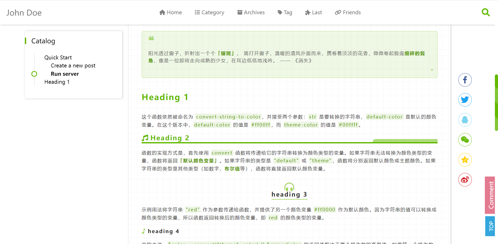
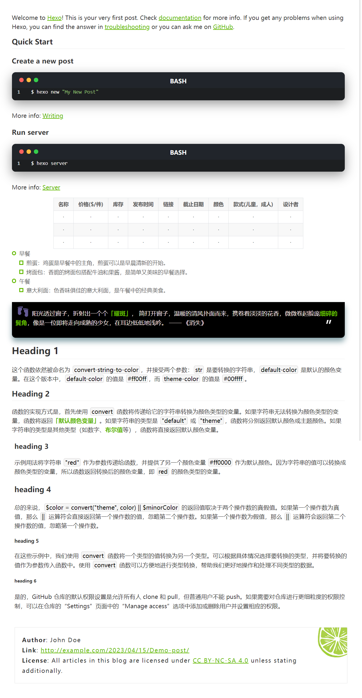
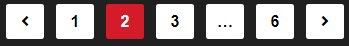

## Language

Currently supported language list:

- en: English
- zh-cn: 简体中文
- zh-tw: 繁體中文
- es: Español (Spanish)
- fr: Français (French)
- de: Deutsch (German)
- ja: 日本語 (Japanese)
- ru: Русский (Russian)
- ko: 한국어 (Korean)

**Note: Only Chinese (Simplified and Traditional) and English are translated by the author; other languages are translated by AI.** 

## Top Menu Bar

=== "Configuration"
	
	```yaml
	menu:
	  XXX:
	    path: /
	    ico: ico-name
	  XXX:
	    path: /XXX
	    ico: ico-name
	    submenu:
	      XXX:
	        path:
	        ico:
	```
=== "Preview"
	


- `ico-name` is the name of the icon in Font Awesome.
- `path` is the link you want the icon to point to.

- `submenu` represents a sub-menu.

## Blog Introduction

#### Logo

=== "Configur"

    ``` yaml
    # by using image or svg 
    logo: 
      on: true
      url: /img/o_oyao.svg
    ```

=== "Preview"

    

If the logo is enabled, it will replace the `site name`` in the top left corner using an image or SVG.

#### Avatar

``` yaml
avatar: https://
```

Specify the URL for the avatar stored in the cloud.

#### Brief Personal Introduction

``` yaml
aboutme: XXX
```

A short personal introduction displayed in the sidebar on the article pages.

#### Donation Feature

``` yaml
donate:
  on: true # false
  methods:
    - name: wechat
      enabled: false 
      description: WeChat
      qrCode: /img/wechat.jpg
    - name: alipay
      enabled: true
      description: Alipay
      qrCode: /img/alipay.jpg
    - name: zelle
      enabled: true
      description: Zelle®
      qrCode: /img/zelle.jpg
  defaultMethod: zelle
  description: Like my post?
```

Place the QR codes directly in the hexo-theme-last/source/img/ directory and name them `wechat.jpg`, `zelle.jpg` and `alipay.jpg`.

#### Preview


=== "With Donation"

    

=== "Without Donation"

    

=== "Donation"

    


#### Establishment Date

``` yaml
since: 2019
```

### Contact Information

=== "Configuration"

    ``` yaml
    contacts:
      E-mail: " mailto:o_oyao@outlook.com || fas fa-fw fa-envelope"
      ...
      # 微博: " ||fab fa-fw fa-weibo"
      Twitter: " ||fab fa-fw fa-twitter"
    ```
=== "Preview"

    


- Display contact information at the bottom of each page.
- Utilize Font Awesome icons.

#### Adding New Icons

Format: `XXX: "url_for(XXX)||icon name of XXX"`

- `url_for(XXX)`：The link corresponding to the icon.
- `icon name of XXX`：The entire content of the class attribute inside the `<i class="XXX"></i>` tag in Font Awesome.


## Homepage Style

### Article List Style


The featured image for each article can be customized or you can use the default featured image.

#### Custom Featured Image

```
---
title: 
date: 
tags: 
postImage: https://s1.ax1x.com/2020/09/23/wX2BfU.jpg
description: XXXX
---
```

Add this configuration to the header of each Markdown file:

- `postImage`: Customized location for the featured image.
- `desscription`: Brief description of the article for display on the homepage.

#### Default Article Cover

``` yaml
PostDefaultImage: https://s1.ax1x.com/2020/04/25/J6iz9K.jpg
```

For Markdown files without a configured `postImage`, the default configuration from `_config` will be used.

### Large Image Display

``` yaml
homeCover:
  fixed: true
  url: https://
```

Specify whether the image on the homepage is fixed and does not move upward with scrolling.

### Homepage Carousel

The homepage carousel is composed of the featured image and introduction of each article. To set up the carousel, you need to select the content you want to include.

Add the following information to the header of the Markdown file for the articles you want to include in the carousel:

``` 
---
title: 
date: 
tags: 
isCarousel: true
---
```

=== "Configuration"

    ```yaml
    carousel:
      on: true
      prevNext: true
      indicators:
        on: true
        position: center # left, center, right
        style: line # dot, line
        currentColor:
          color: "#222"
          opacity: 0.9
        otherColor:
          color: "white"
          opacity: 1
      mask:
        on: true
        color: "#000"
        opacity: 0.5
      blur:
        on: true
        px: 5 
      textColor: "#fff" 
    ```

=== "Preview"

    

`preveNext`: Enable arrows on both sides.

`indicators`：Display indicators below the images.

- `position`：Indicators' position (left, center, right).

- `style`：Indicators' style (dot, line).

- `currentColor`：Color of the current image's indicator.

- `otherColor`：Color of the indicators for images that are not current.

`mask`: Background image shadow mask.

- `color`：The color of the shadow can be represented by any **hexadecimal color** code or **color name**.
- `opacity`：Opacity of the shadow (0-1).

`blur`：The degree of background image blur is quantified in pixels (px).

`textColor`：Color of the text on the image.


### Article List Style

``` yaml
clampLines: 8
```

`clampLines` specifies how many lines of the description for each article should be displayed on the homepage. It should be an integer.

### Article Layout

```yaml
homeRowMaxItem: 6 ## 3-6
```
Specifies the maximum number of articles displayed in a row on the homepage, ranging from 3 to 6.


## Article Page

### Word Count

```yaml
wordCount: false
```

Requires the installation of the `hexo-wordcount` plugin: 

```bash
npm install hexo-wordcount
```

### Content Expiry Reminder

``` yaml
Warning:
  on: true
  Days: 200
  Content: "This article was written {} days ago. The content of the article may be out of date."
```

Displayed at the beginning of each article.


- If `warning.on` is enabled, each article comes with a reminder.
- You can also add `Warning: true` in the markdown file of each article to enable the expiry reminder.
- `Days` sets the expiration limit in days.
- In the `Content` section, `{}` represents the value of `Days`, and the remaining text can be modified as needed.

### Page Styles

``` yaml
postStyle:
  authorInfoPosition: right
  contentStyle: github
  color: "default"
  codeStyle:
    style: mac # mac, tab
    colorSet: sakura-light # sakura, sakura-light
    # dark style or light style. This is only applied to styles not colorSet
    light: true # false, true
```

- `authorInfoPosition`：Determines the position of the table of contents and the author's avatar, either on the left or right.

	=== "right"
		

	=== "left"
		

- `contentStyle`：Options for the style of article pages.

	=== "github"
		
	=== "music"
		
	=== "microsoft"
		

- `color`：Main theme color of the article pages.

    - Default is `default`
    - You can also use color names available in CSS or specify a hexadecimal color code (e.g., #XXXXXX).

- `codeStyle`: Code block styles

    - style: Style of the code block.
    - colorSet: Color theme for the code.
    - light: Whether it's a light-colored theme.

	=== "mac-dark"
		
	=== "mac-light"
		
	=== "tab-dark"
		
	=== "tab-light"
		


### Copyright Information

``` yaml
copyright:
  on: true
  simple: false
  license: "CC BY-NC-SA 4.0"
  fullName: "Attribution-NonCommercial-ShareAlike 4.0 International"
  url: "https://creativecommons.org/licenses/by-nc-sa/4.0/"
  icon: "creative-commons"
```

- `simple`: Determines the style of copyright information.
- `license`: Short name of the license.
- `fullName:` Full name of the license.
- `url`: URL link to the license.
- `icon `: Font Awesome icon name for the license.

For the complex style, the pattern can be replaced by the image at `/img/license-decoration.png` to achieve customization.

=== "simple: on"

    

=== "simple: false"

    

=== "Customized+simple: false"

    


## Paginator

### Multiple Article Pagination

``` yaml
paginationNumberBackground: true
```
=== "true"
	
=== "false"
	

### Single Article Pagination

``` yaml
postPagePaginationStyle: card # normal  picture  card
```
=== "card"
	
=== "picure"
	
=== "normal"
	

## Scrolling

### Back to Top


```yaml
SideButtons:
  style: "both" # "icon", word", "both"
  Top:
    on: true
    color: "#e37a90" # "#e37a90" hex color
  Comment:
    on: true
    color: "#33a6dc" # "#33a6dc" hex color
```

=== "both"

    

=== "word"

    

=== "icon"

    

`Top` represents back to the top, and `Comment` indicates going to the comments section. If the comment feature is not enabled, the button is not displayed by default.


### Scrollbar

```yaml
ScrollBar:
  style: "bicolor" # "bicolor", "simple", "gradient"
  color: "theme" # "default" "theme" "#459798"
  shape: "square" # "square", "round"
  gradient:
    color1: "skyblue"
    color2: "purple"
```

- Three styles of the scrollbar.

- `color`: Customizable scrollbar color or use `theme` to follow the theme color.

- `shape`: Shape of scrollbar, wether round or square

- `gradient`: The scrollbar will gradient from `color1` to `color2`.

=== "bicolor"

    

=== "simple"

    

=== "gradient"

    


## Message Alert

```yaml
alertStyle:
  colorBackground: false # false will use page's background
  position: right # right, center, left
```

=== "right"

    

=== "left"

    

=== "center"

    