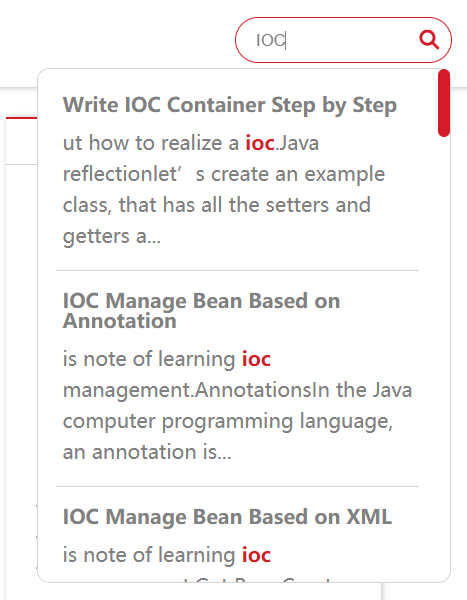

## Table of Contents

```yml
toc:
  on: true
```


## Search Function (Local Search Only)

### Local Search

=== "Configuration"

    ```yml
    localSearch:
      on: true
      placeholder: "Type to search"
    ```
=== "Preview"

    

This feature requires the installation of the `hexo-generator-search` plugin.

``` bash
npm install hexo-generator-search
```
Then, you need to configure the search in the `_config.yml` file in the root directory.

```yaml
search:
  path: search.xml
  field: all
  content: true
```

For more information on using `hexo-generator-search`, please refer to [https://github.com/wzpan/hexo-generator-search](https://github.com/wzpan/hexo-generator-search)

## Share Function

Using https://github.com/overtrue/share.js

```yml
Share:
  on: true 
  datasites: "facebook,twitter,qq,wechat,qzone,weibo" 
  wechatQrcodeTitle: "微信扫一扫：Share"
```

`datasites`includes options for sharing on various platforms, such as Facebook, Twitter, QQ, WeChat, Qzone, Weibo, and more.


You can choose any combination of these platforms in any order.

`wechatQrcodeTitle`：The title for the WeChat floating QR code.


## Comment Function (Incomplete, only implemented for Valine)

```yml
valine:
  on: true
  appId:  # App ID
  appKey: # App Key
  verify: true # Verification code
  notify: true # Email notification for comment replies
  avatar: mp # Anonymous avatar option
  placeholder: Leave your email address so you can get reply from me!
  lang: zh-cn
  guest_info: nick,mail,link
  pageSize: 10
```

Details on how to use this will be provided later.

## Mathematical Formulas

```yml
mathjax:
  enable: true
  per_page: true
  cdn: https://cdn.jsdelivr.net/npm/mathjax/MathJax.js?config=TeX-AMS-MML_HTMLorMML
```

Requires `hexo` plugin `hexo-math` and `hexo-renderer-kramed `

```
npm install hexo-math hexo-renderer-kramed
```

The CDN can be customized, but the default should work in most cases.

It uses `kramed` for rendering, and the syntax requirements are strict. Ensure correct syntax for proper rendering.

**If rendering issues occur, try the following:**

1. Go to the `/node_modules/kramed/lib/rules/inline.js` file.

2. Comment out line 11 for `escape` and add a new line:

   ```js
   // escape: /^\\([\\`*{}\[\]()#$+\-.!_>])/,
   escape: /^\\([`*\[\]()#$+\-.!_>])/,
   ```

3. Comment out line 21 for `em` and add a new line:

   ```js
   // em: /^\b_((?:__|[\s\S])+?)_\b|^\*((?:\*\*|[\s\S])+?)\*(?!\*)/,
   em: /^\*((?:\*\*|[\s\S])+?)\*(?!\*)/,
   ```

4. Save the changes.

**Typically, inline formula rendering is correct, and issues may arise from syntax errors in block-level formulas. Ensure strict syntax correctness.**

## Site Visit Statistics (Currently Implemented for a Single Method)

### Busuanzi

[https://busuanzi.ibruce.info/](https://busuanzi.ibruce.info/)

```yaml
visits:
  on: true
```