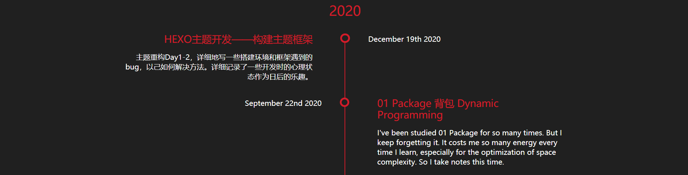
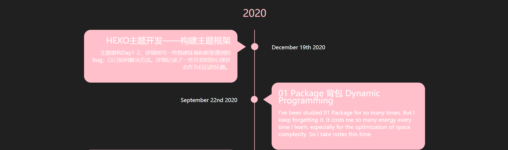
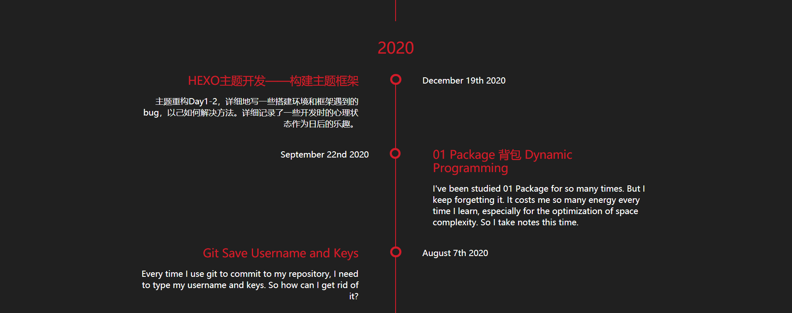
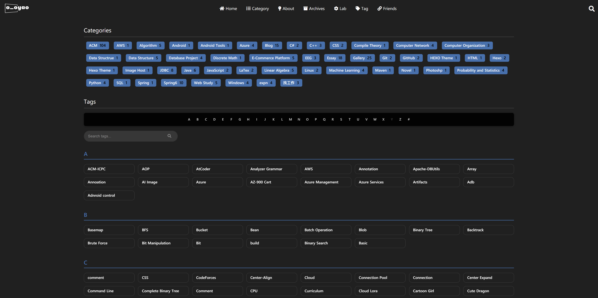
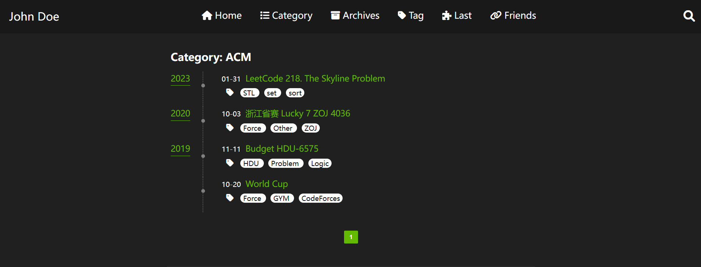
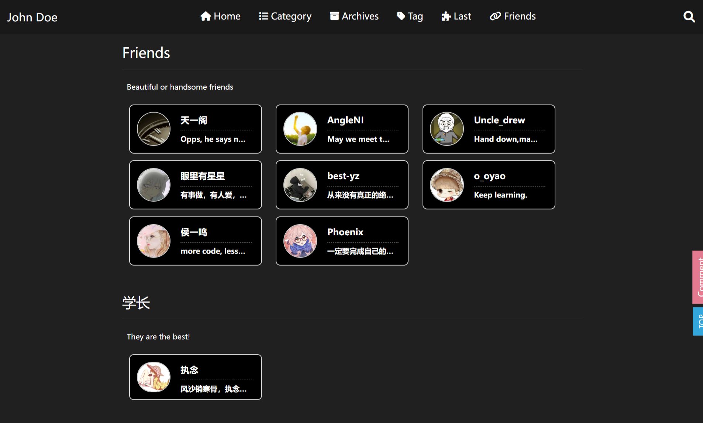
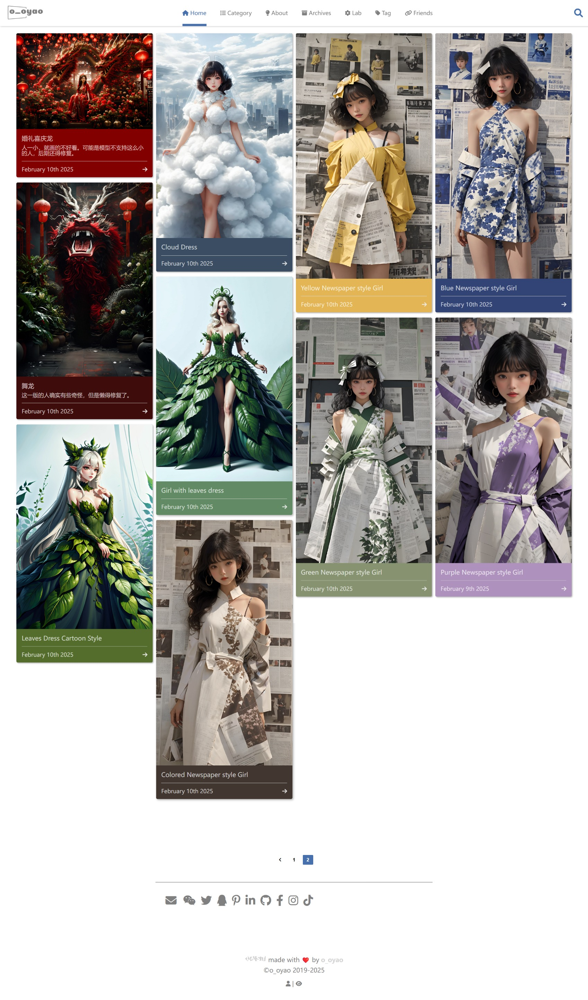

First, use the built-in Hexo command `hexo new page "page name"` to create a new page.

## Archive Page

This page is pre-built and does not require manual creation.。


```yml
archiveStyle:
  style: normal
  type: center # basic, split, center
  color: pink
```
**`style`**：comment-shape、normal

=== "normal"

	
=== "comment-shape"
	

**`type`Structure**：basic、split、center
=== "center"
	
=== "split"
	
=== "basic"
	


## Tags，Categories Pages

Need to reate a page named`tags`

```
hexo new page tags
```

### Preview

=== "Overall Page"

    

=== "Overall Page with Alphabet Index"

    

=== "Categories"

    

=== "Tags"

    

```yml
tagsPage:
  category:
    show_count: true # false
  tag:
    show_count: false # false
    alphabet_index: false # true 
    korean:
      enabled: true
```

`alphabet_index` tags are grouped by first letter with search and navigation（Support Only English, Chinese, Japanese, Korean）

Korean words are categorized differently from Chinese or English. In Korean dictionaries and indexes, words are grouped by their initial consonant (초성, Choseong). For example:

- “가방” will be categorized under ㄱ

- “나무” will be categorized under ㄴ

enabled: false → Do not apply Choseong grouping; all Korean entries will be placed under the # section by default

## Friends Links

Create a friends links page.

``` bash
hexo new page links
```

How to add friends links:

1. Locate`/source/links/index.md`

2. Add a link inside the === === paragraph.

   ```markdown
   links:
     - group_name: Friends
       description: Beautiful or handsome friends
       items:
       - url: https://
         img: https://
         name: XXX
         description: Opps, he says nothing.
   ```

   - `group_name` groups the links.
   - `description` is the description of each group.
   - `items` contains individual links.
     - Each link has four pieces of information: website address, avatar address, website name, and website description.
     - Each link starts with a `-`, following the above format.

**Note: The seemingly tab-like indentation inside must be spaces, not tabs.**



## Gallery

The gallery page is essentially a regular categories page, so each gallery is just a normal post file.

There is no need to configure an additional page; simply add a button in the top menu to access it. The path must be set to `/categories/Gallery` for it to work correctly.

```yml
ymlCopyEditxxx:
  path: /categories/Gallery
  ico: ico-name
```

You also need to configure the following in the front matter of the post:

```yml
ymlCopyEdittitle: xxxx
date: xxxx-xx-11 04:39:38
tags: 
categories: Gallery
cover: https://cdn.jsdelivr.net/gh/DyingDown/img-host-repo/AI/202502110542366.png
color: 8b9238
```

- `categories: Gallery` Case-sensitive; categorizes the file under "Gallery."
- `cover:` The cover image for each gallery; provide the image URL.
- `color:` The background color(hex color) for each gallery display (in the album module).

### Module Preview

