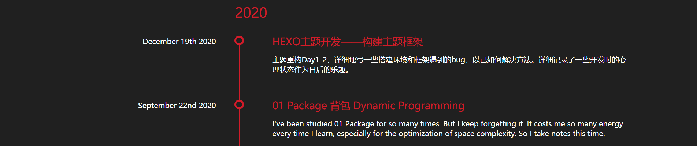
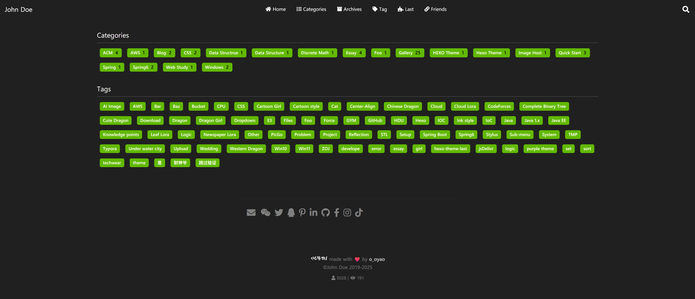
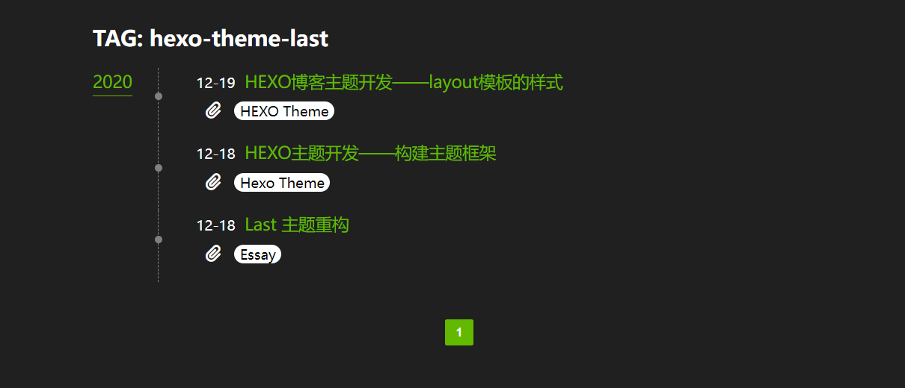

First, use the built-in Hexo command `hexo new page "page name"` to create a new page.

## Archive Page

This page is pre-built and does not require manual creation.。


```yml
archiveStyle:
  style: normal
  type: center # basic, split, center
  color: pink
```
**`style`**：comment-shape、normal

=== "normal"

	
=== "comment-shape"
	

**`type`Structure**：basic、split、center
=== "center"
	
=== "split"
	
=== "basic"
	


## Tags，Categories Pages

Need to reate a page named`tags`

```
hexo new page tags
```

### Preview

=== "Overall Page"

    

=== "Categories"

    

=== "Tags"

    

## Friends Links

Create a friends links page.

``` bash
hexo new page links
```

How to add friends links:

1. Locate`/source/links/index.md`

2. Add a link inside the === === paragraph.

   ```markdown
   links:
     - group_name: Friends
       description: Beautiful or handsome friends
       items:
       - url: https://
         img: https://
         name: XXX
         description: Opps, he says nothing.
   ```

   - `group_name` groups the links.
   - `description` is the description of each group.
   - `items` contains individual links.
     - Each link has four pieces of information: website address, avatar address, website name, and website description.
     - Each link starts with a `-`, following the above format.

**Note: The seemingly tab-like indentation inside must be spaces, not tabs.**

