## 语言

目前支持的语言列表：

- en: English
- zh-cn: 简体中文
- zh-tw: 繁體中文
- es: Español (西班牙语)
- fr: Français (法语)
- de: Deutsch (德语)
- ja: 日本語 (日语)
- ru: Русский (俄语)
- ko: 한국어 (韩语)

**注意： 只有中文简体繁体和英语是作者翻译，其他的语言都是由AI进行翻译得到的.**

## 顶部菜单栏

=== "配置"
	
	```yaml
	menu:
	  XXX:
	    path: /
	    ico: ico-name
	  XXX:
	    path: /XXX
	    ico: ico-name
	    submenu:
	      XXX:
	        path:
	        ico:
	```
=== "预览"
	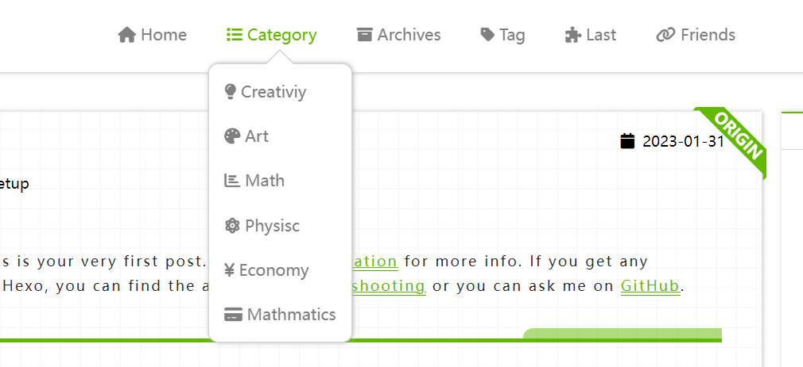


- `ico-name`是图标在**Font Awesome**里面的图标的名称
- `path`是你想让图标链接到的地址

- `submenu`是二级标题

## 博客简介

#### Logo

=== "配置"

    ``` yaml
    # by using image or svg 
    logo: 
      on: true
      url: /img/o_oyao.svg
    ```

=== "预览"

    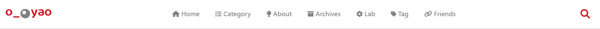

如果开启logo，将使用图片或者svg图片来替代左上角的`site name`

#### 头像

``` yaml
avatar: https://
```

写出头像在云端存储的连接

#### 个人简短介绍

``` yaml
aboutme: XXX
```

简短的个人介绍，在文章页面的侧边栏里展示

#### 打赏功能

``` yaml
donate:
  on: true # false
  methods:
    - name: wechat
      enabled: false 
      description: WeChat
      qrCode: /img/wechat.jpg
    - name: alipay
      enabled: true
      description: Alipay
      qrCode: /img/alipay.jpg
    - name: zelle
      enabled: true
      description: Zelle®
      qrCode: /img/zelle.jpg
  defaultMethod: zelle
  description: Like my post?
```

直接把二维码放在`hexo-theme-last/source/img/`下面，命名为`wechat.jpg` ，`zelle.jpg`和`alipay.jpg`

#### 预览


=== "有打赏"

    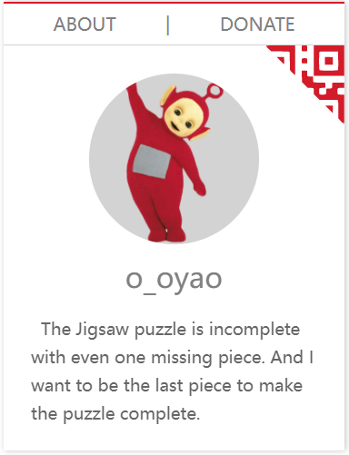

=== "无打赏"

    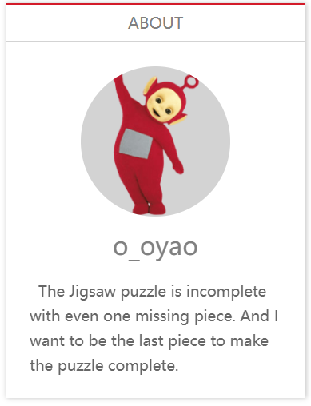

=== "打赏"

    


#### 成立日期

``` yaml
since: 2019
```

### 联系信息

=== "配置"

    ``` yaml
    contacts:
      E-mail: " mailto:o_oyao@outlook.com || fas fa-fw fa-envelope"
      ...
      # 微博: " ||fab fa-fw fa-weibo"
      Twitter: " ||fab fa-fw fa-twitter"
    ```
=== "预览"

    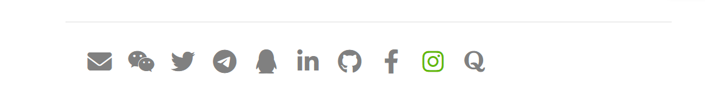


- 在每个页面底部展示联系信息
- 使用font awesome图标

#### 添加新的图标

格式：`XXX: "url_for(XXX)||icon name of XXX"`

- `url_for(XXX)`：这里的是图标对应的连接
- `icon name of XXX`：是font awesome里面的图标的`<i class="XXX"></i>`标签里面**class**的全部内容


## 首页样式

### 文章列表样式

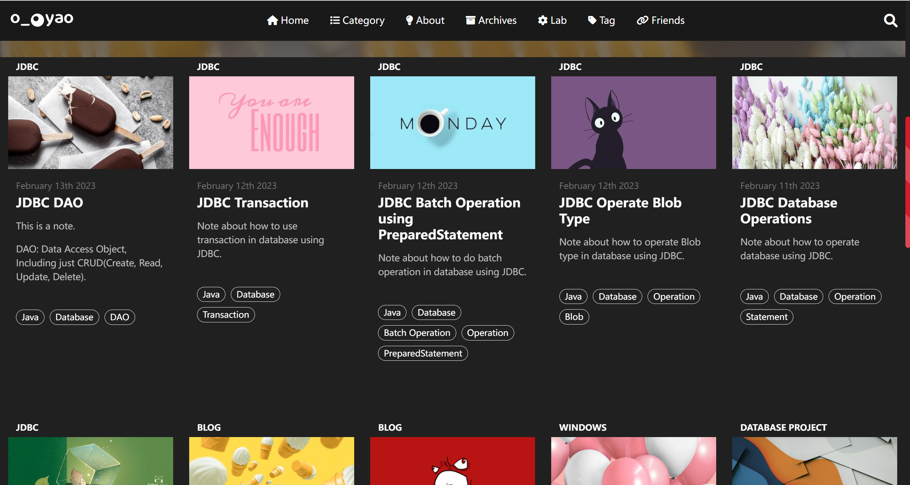

每篇文章的配图可以自定义也可以使用默认配图。

#### 自定义配图

```md
---
title: 
date: 
tags: 
postImage: https://s1.ax1x.com/2020/09/23/wX2BfU.jpg
description: XXXX
---
```

在每篇md文件的头部添加配置

- `postImage`: 是自定义配图存储的位置
- `desscription`: 是文章内容的简介，用于首页展示


#### 默认文章封面

``` yaml
PostDefaultImage: https://s1.ax1x.com/2020/04/25/J6iz9K.jpg
```

没有给md文件配置`postImage`的，会默认使用`_config`中的配置


### 大图展示

``` yaml
homeCover:
  fixed: true
  url: https://
```

首页的图是否是固定的，不随着滑动而向上移动

### 首页的轮播图

首页的轮播图由每篇文章的配图以及介绍组成。想设置轮播图需要先选出希望轮播的内容。

在要轮播的文章的md文件头部添加信息

```md
---
title: 
date: 
tags: 
isCarousel: true
---
```

=== "配置"

    ```yaml
    carousel:
      on: true
      prevNext: true
      indicators:
        on: true
        position: center # left, center, right
        style: line # dot, line
        currentColor:
          color: "#222"
          opacity: 0.9
        otherColor:
          color: "white"
          opacity: 1
      mask:
        on: true
        color: "#000"
        opacity: 0.5
      blur:
        on: true
        px: 5 
      textColor: "#fff" 
    ```

=== "预览"

    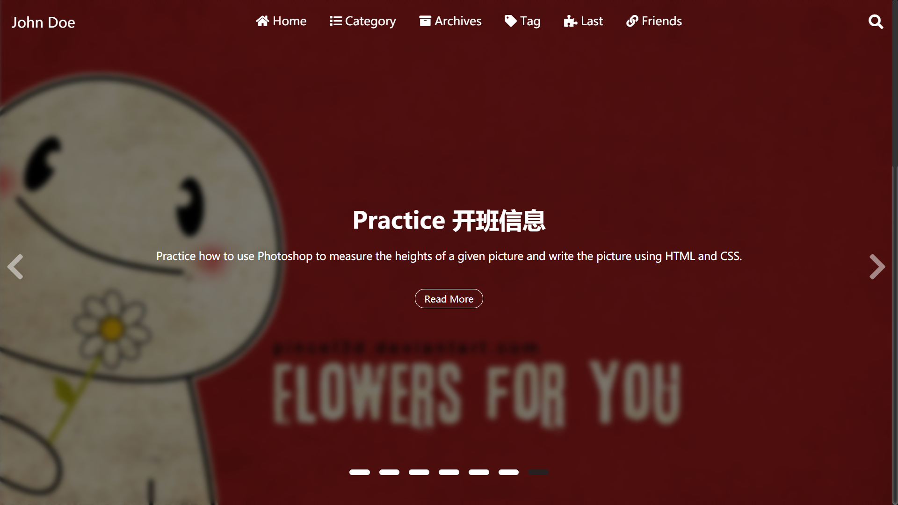

`preveNext`: 是否开启两侧的箭头标志

`indicators`：图片下面的指示器

- `position`：指示器的位置，有左、中、右三种

- `style`：指示器的形状，有长条，圆点两种

- `currentColor`：当前图片，指示器的颜色

- `otherColor`：没轮到的指示器的颜色

`mask`: 背景图片阴影 蒙版

- `color`：阴影的颜色，可以时任意的**十六进制**颜色表示，或者**颜色名字**
- `opacity`：透明度（0-1）之间的小数

`blur`：背景图片模糊程度，`px`数字表示模糊的程度的像素量化

`textColor`：图片上文字的颜色


### 文章列表样式

``` yaml
clampLines: 8
```

`clampLines` 是首页每篇文章的描述内容展示多少行，是一个整数数字

### 文章排版

```yaml
homeRowMaxItem: 6 ## 3-6
```
一行最多展示几个文章，最大为6个，最小为3个

## 文章页面

### 字数统计

```yaml
wordCount: false
```

需要安装插件`hexo-wordcount` 

```bash
npm install hexo-wordcount
```

### 内容过期提醒

``` yaml
Warning:
  on: true
  Days: 200
  Content: "This article was written {} days ago. The content of the article may be out of date."
```

在文章前面显示

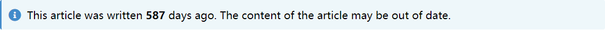

- 如果在`warning.on`上打开，则每篇文章都自带提醒
- 还可以在每篇文章的`md`文件里添加`Warning: true`来打开文章的过期提醒
- `Days`是过期的天数限制
- `Content`里面的`{}`，就是`Days`的数值，剩下的文字都可以任意修改。

### 页面的样式

``` yaml
postStyle:
  authorInfoPosition: right
  contentStyle: github
  color: "default"
  codeStyle:
    style: mac # mac, tab
    colorSet: sakura-light # sakura, sakura-light
    # dark style or light style. This is only applied to styles not colorSet
    light: true # false, true
```

- `authorInfoPosition`：是目录和个人简介头像的位置，有左、右两个位置

	=== "right"
		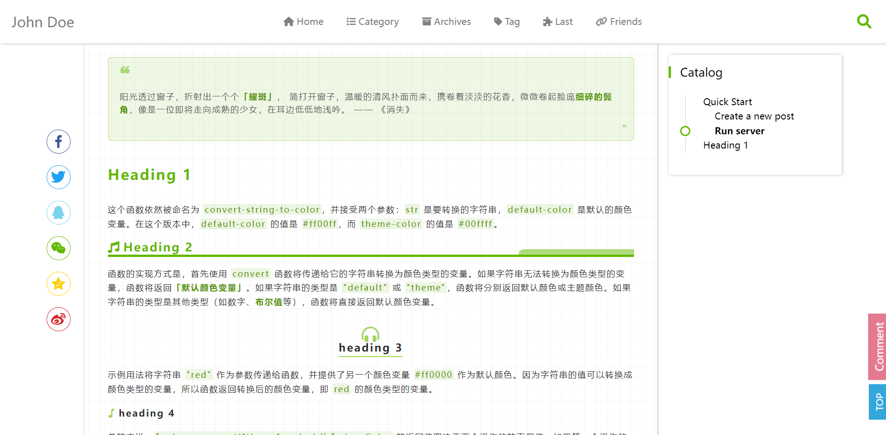

	=== "left"
		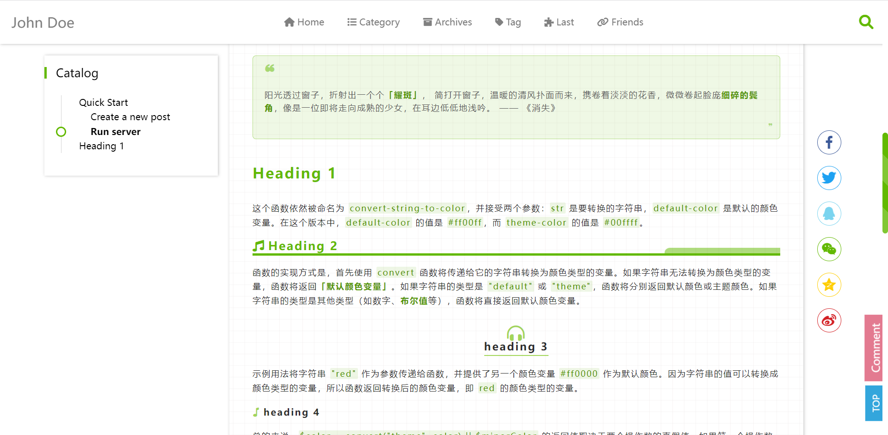

- `contentStyle`：文章页面的样式选项


	=== "github"
		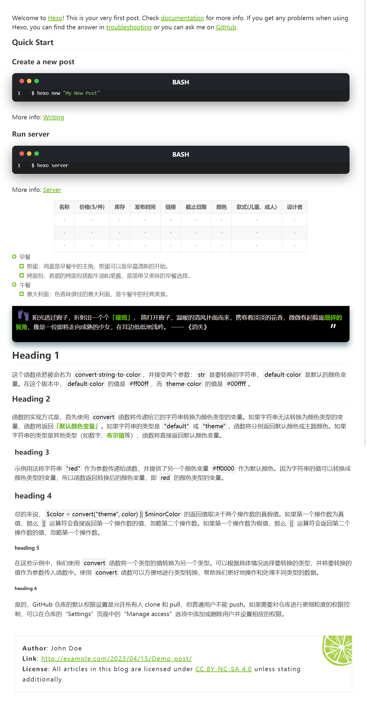

	=== "music"
		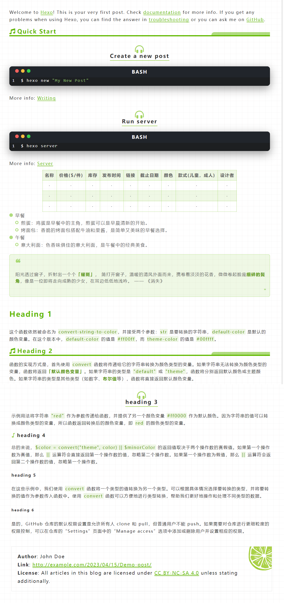
		
	=== "microsoft"
		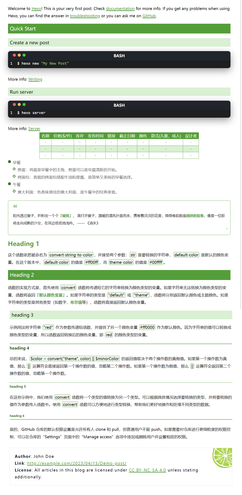

	=== "lapis"
		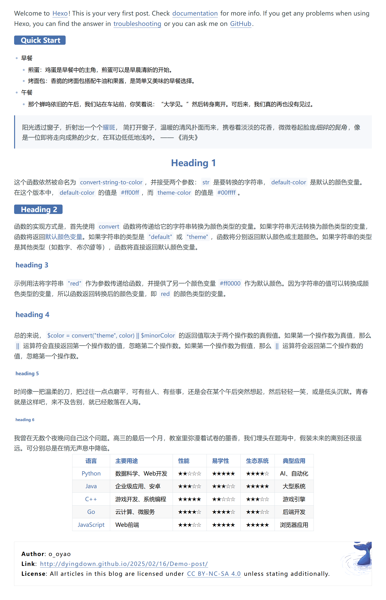

	=== "gitbook"
		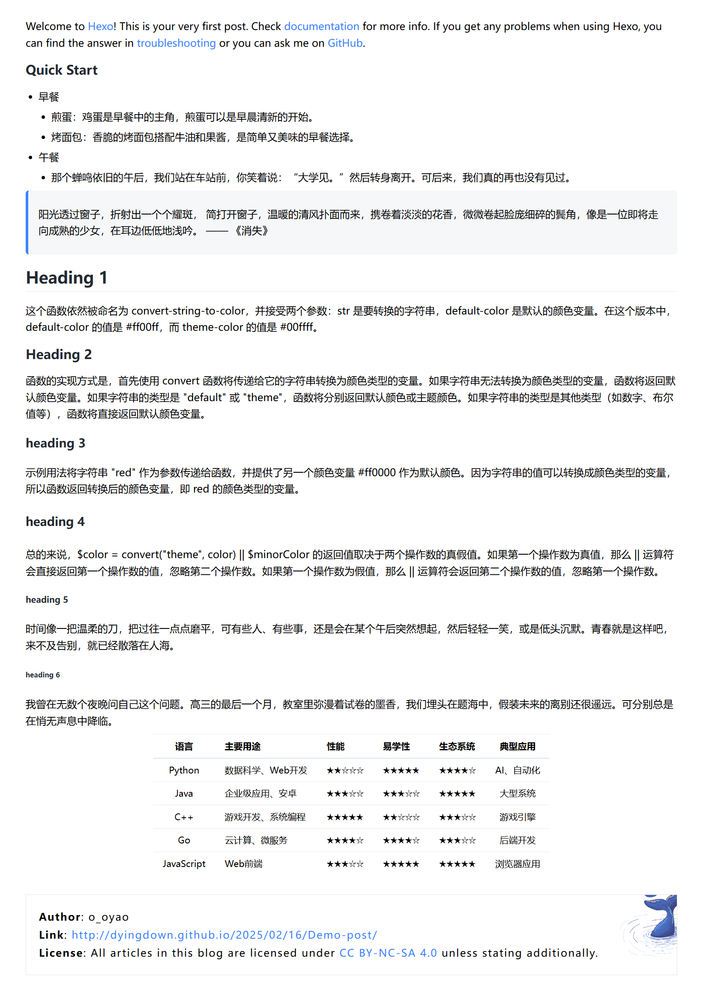
  

- `color`：文章页面的主题颜色

    - 默认就是`default`
    - 还可以填入颜色的名字，是在`css`里面可用的颜色名字
    - 可以填入`#XXXXXX`，以`#`开头的以十六进制的颜色

- `codeStyle`: 代码块样式

    - style: 代码块的样式
    - colorSet: 代码颜色主题
    - light: 是不是浅色

	=== "mac-dark"
		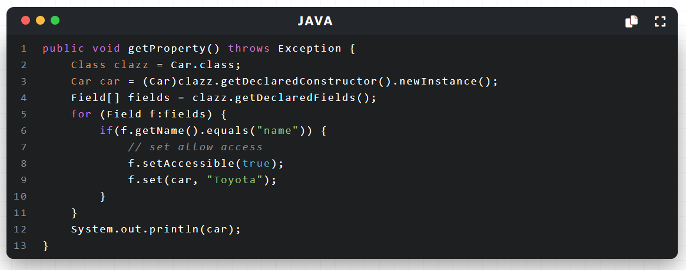
	=== "mac-light"
		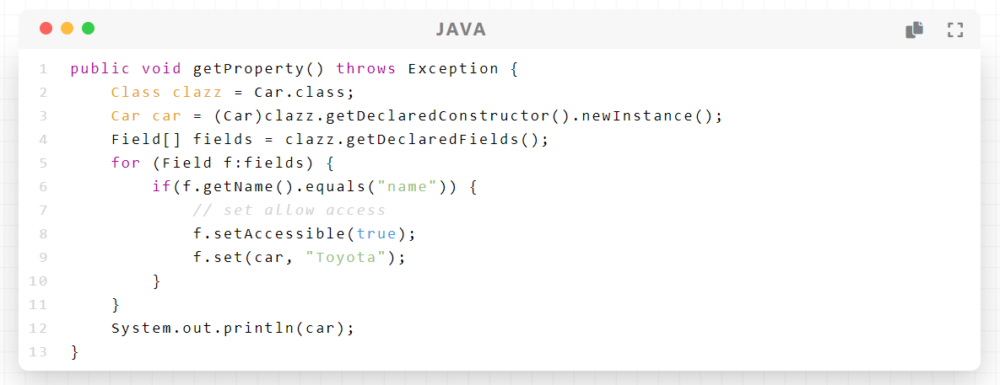
	=== "tab-dark"
		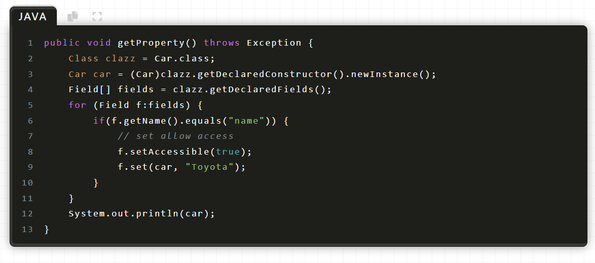
	=== "tab-light"
		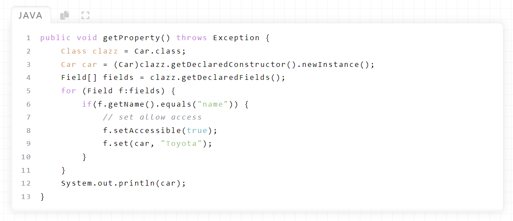

**注意：hexo渲染Todo list可能会不成功: 可能解决办法 [点击查看](http://localhost:4000/2023/12/16/Hexo-To-Do-List-unable-to-render-properly/)**

### 版权信息

``` yaml
copyright:
  on: true
  simple: false
  license: "CC BY-NC-SA 4.0"
  fullName: "Attribution-NonCommercial-ShareAlike 4.0 International"
  url: "https://creativecommons.org/licenses/by-nc-sa/4.0/"
  icon: "creative-commons"
```

- `simple` 标签表示版权的两种样式
- `license` 是license的短名字
- `fullName` license的全名
- `url` 该license的URL链接
- `icon `该license的font awesome 的 icon名称

其中复杂样式里面的图案，可替换`/img/license-decoration.png` 图案，达到自定义的效果。

=== "simple: on"

    

=== "simple: false"

    

=== "自定义+simple: false"

    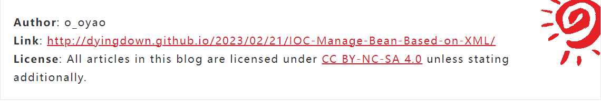


## Paginator分页

### 多文章分页

``` yaml
paginationNumberBackground: true
```
=== "true"
	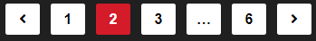
=== "false"
	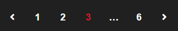

### 单文章分页

``` yaml
postPagePaginationStyle: card # normal  picture  card
```
=== "card"
	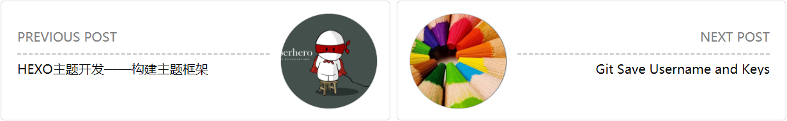
=== "picure"
	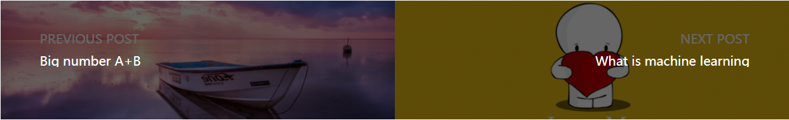
=== "normal"
	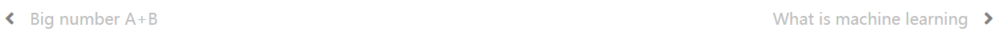

## 滚动

### 回到顶部

```yaml
SideButtons:
  style: "both" # "icon", word", "both"
  Top:
    on: true
    color: "#e37a90" # "#e37a90" hex color
  Comment:
    on: true
    color: "#33a6dc" # "#33a6dc" hex color
```

=== "both"

    

=== "word"

    

=== "icon"

    

`Top`表示回到顶部，`Comment`表示到评论区。如果评论功能未开启，则默认不展示该按钮


### 滚动条

```yaml
ScrollBar:
  style: "bicolor" # "bicolor", "simple", "gradient"
  color: "theme" # "default" "theme" "#459798"
  shape: "square" # "square", "round"
  gradient:
    color1: "skyblue"
    color2: "purple"
```

- 滚动条有三种样式
- `color`: 可以自定义滚动条颜色，或者使用"theme"就跟随主题的颜色
- `shape`: 滚动条形状，圆角或者方形
- `gradient`: 滚动条会从`color1`渐变到`color2`

=== "bicolor"

    

=== "simple"

    

=== "gradient"

    


## 消息弹窗

```yaml
alertStyle:
  colorBackground: false # false will use page's background
  position: right # right, center, left
```

=== "right"

    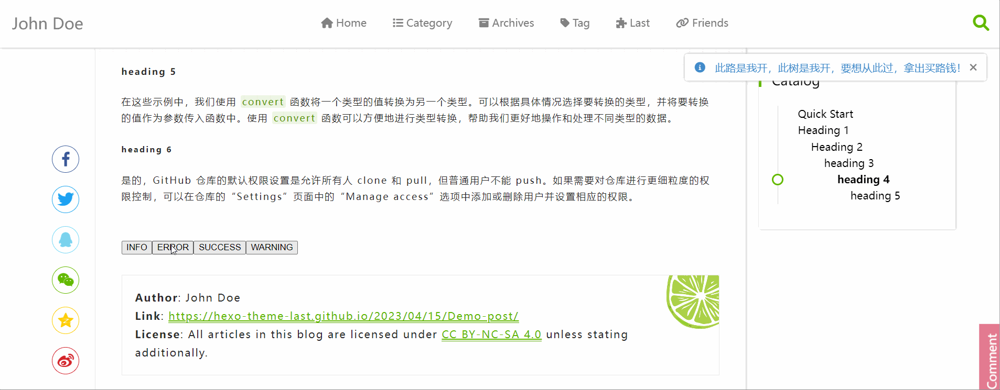

=== "left"

    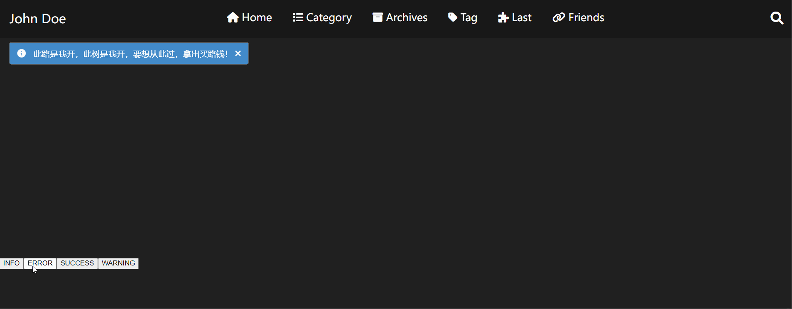

=== "center"

    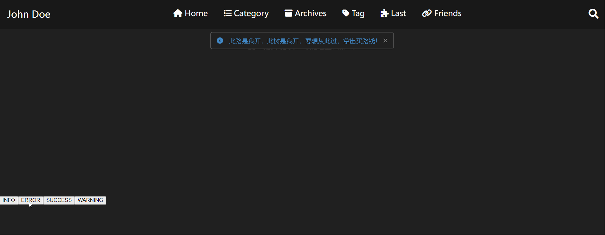