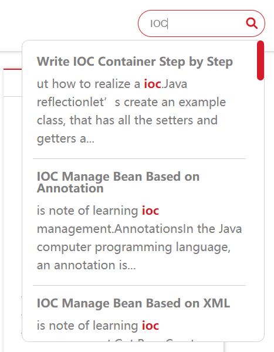

## 目录

```yml
toc:
  on: true
```


## 搜索功能

主题支持三种搜索引擎：本地搜索（local）、Lunr.js搜索和Algolia云搜索。根据您的需求选择合适的搜索方式。

### 搜索引擎对比

| 搜索引擎 | 性能 | 中文支持 | 部署难度 | 推荐场景 |
|---------|------|----------|----------|----------|
| **Local** | 较慢 | 基础支持 | 简单 | 小型站点，快速部署 |
| **Lunr** | 快速 | 优秀 | 简单 | 中大型站点，最佳选择 |
| **Algolia** | 极快 | 优秀 | 复杂 | 大型站点，需要高级搜索功能 |

=== "配置示例"

    ```yml
    search:
      enable: true
      engine: lunr
      
      local:
        path: search.xml
        
      lunr:
        path: search.json
        maxResults: 30
        minQueryLength: 1
        debounceTime: 300
        
      algolia:
        # Algolia 配置在站点根目录 _config.yml 中设置
    ```
=== "本地 & Lunr 搜索"
    
    

=== "Algolia"
    
    


### 配置参数说明

| 参数 | 说明 | 默认值 | 适用引擎 |
|------|------|--------|----------|
| `enable` | 启用搜索功能 | `true` | 所有 |
| `engine` | 搜索引擎类型：`local`, `lunr`, `algolia` | `lunr` | 所有 |
| **Local 搜索参数** | | | |
| `local.path` | 搜索文件路径，需与站点 `_config.yml` 中的 `search.path` 匹配 | `search.xml` | Local |
| **Lunr 搜索参数** | | | |
| `lunr.path` | 搜索文件路径，建议使用 JSON 格式提升性能 | `search.json` | Lunr |
| `lunr.maxResults` | 最大搜索结果显示数量 | `30` | Lunr |
| `lunr.minQueryLength` | 最小查询长度（1允许单字符搜索，适合中文/日文） | `1` | Lunr |
| `lunr.debounceTime` | 搜索延迟（毫秒，减少服务器负载） | `300` | Lunr |
| **Algolia 搜索参数** | | | |
| `algolia.*` | Algolia 的所有配置需在站点根目录的 `_config.yml` 中设置 | - | Algolia |

### 安装和配置

#### 安装依赖插件

根据选择的搜索引擎，安装对应的插件：

=== "本地搜索 & Lunr 搜索"

    ```bash
    npm install hexo-generator-search
    ```

=== "Algolia 搜索"

    ```bash
    npm install hexo-algoliasearch --save
    ```

#### 配置站点搜索

在站点根目录的 `_config.yml` 文件中添加搜索配置：

=== "本地搜索 (Local)"

    ```yaml
    search:
      path: search.xml
      field: all
      content: true
    ```

=== "Lunr 搜索 (推荐)"

    ```yaml
    search:
      path: search.json  # 使用 JSON 格式提升性能
      field: all
      content: true
    ```

=== "Algolia 搜索"

    ```yaml
    algolia:
      appId: "YOUR_APP_ID"
      apiKey: "YOUR_SEARCH_ONLY_API_KEY" 
      adminApiKey: "YOUR_ADMIN_API_KEY"
      indexName: "YOUR_INDEX_NAME"
      chunkSize: 5000
      fields:
        - content:strip:truncate,0,500
        - excerpt:strip
        - tags
        - title
        - path
    ```

#### Algolia 额外步骤

如果使用 Algolia 搜索，每次更新内容后需要手动上传索引：

```bash
npx hexo algolia
```

注意：

- Algolia 需要单独的插件 `hexo-algoliasearch`，不是 `hexo-generator-search`
- 每次发布新内容后，都需要运行 `npx hexo algolia` 命令更新搜索索引
- 确保在 Algolia 控制台中已创建对应的索引


## 分享功能

https://github.com/overtrue/share.js

```yml
Share:
  on: true 
  datasites: "facebook,twitter,qq,wechat,qzone,weibo" 
  wechatQrcodeTitle: "微信扫一扫：Share"
```

`datasites`是可以分享的站点，有这么多可以选择


微博、QQ空间、QQ好友、微信、腾讯微博、豆瓣、Facebook、Twitter、Linkedin、Google+、点点等社交网站。（其中Google+好像已经不能使用）

可以按照任意顺序组合

`wechatQrcodeTitle`：微信分享功能的悬浮二维码的标题


## 评论功能(没完成，只完成了valine)

```yml
valine:
  on: true
  appId:  # App ID
  appKey: # App Key
  verify: true # 验证码
  notify: true # 评论回复邮箱提醒
  avatar: mp # 匿名者头像选项
  placeholder: Leave your email address so you can get reply from me!
  lang: zh-cn
  guest_info: nick,mail,link
  pageSize: 10
```

具体如何使用后续会写

## 数学公式

```yml
mathjax:
  enable: true
  per_page: true
  cdn: https://cdn.jsdelivr.net/npm/mathjax/MathJax.js?config=TeX-AMS-MML_HTMLorMML
```

需要`hexo`插件`hexo-math` 和 `hexo-renderer-kramed ` 的支持

```
npm install hexo-math hexo-renderer-kramed
```

cdn可以自己配置，但是一般默认的就行。

是用`kramed`渲染，语法要求比较严格，需要绝对的正确的语法才能正确渲染，比如一些空格不能省略，因为它没有`Typora`使用的`pandoc`渲染功能强大。

**如果出现无法渲染的情况，尝试进行如下操作：**

1. 进入`/node_modules/kramed/lib/rules/inline.js`文件

2. 注释11行`escape`，添加一行:

   ```js
   // escape: /^\\([\\`*{}\[\]()#$+\-.!_>])/,
   escape: /^\\([`*\[\]()#$+\-.!_>])/,
   ```

3. 注释21行`em`，添加一行:

   ```js
   // em: /^\b_((?:__|[\s\S])+?)_\b|^\*((?:\*\*|[\s\S])+?)\*(?!\*)/,
   em: /^\*((?:\*\*|[\s\S])+?)\*(?!\*)/,
   ```

4. 保存修改

**一般内联公式渲染正确，行间公式渲染错误，考虑是否行间公式出现语法错误，必须使严格语法正确。**

## 站点访问统计(目前只实现了一种)

### 不蒜子

[https://busuanzi.ibruce.info/](https://busuanzi.ibruce.info/)

```yaml
visits:
  on: true
```