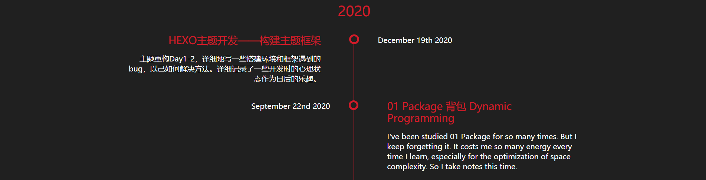
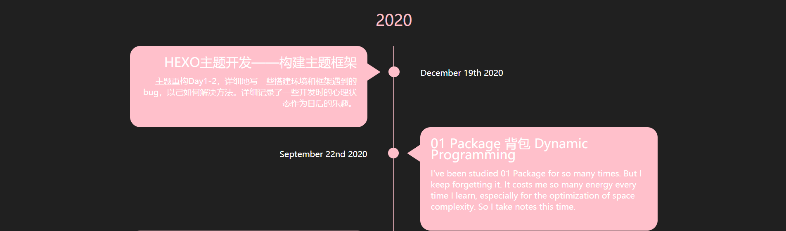
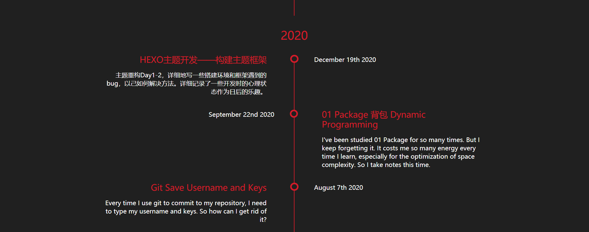
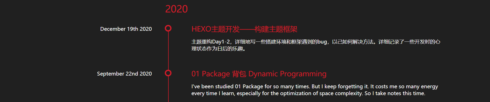
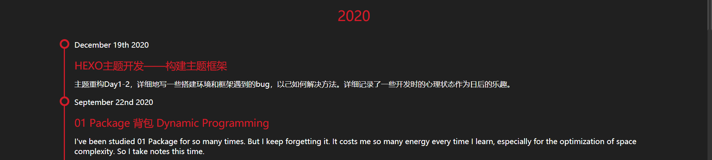
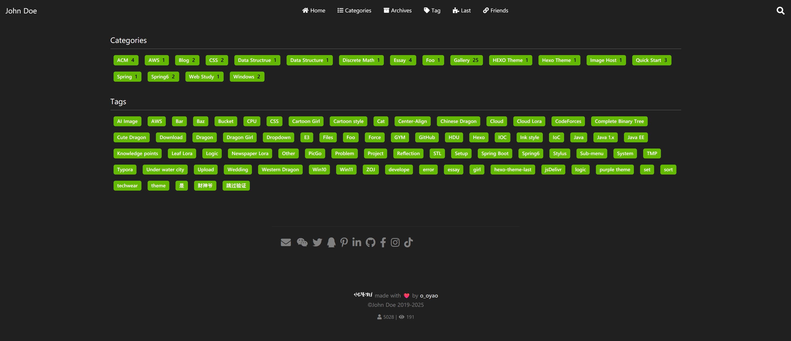
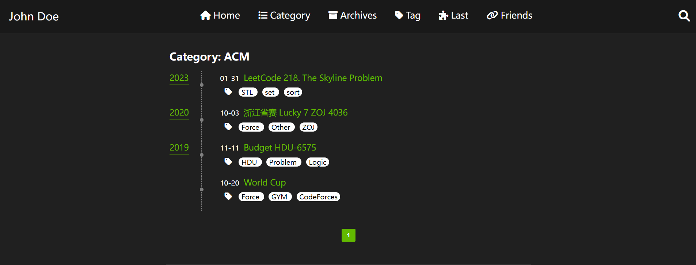
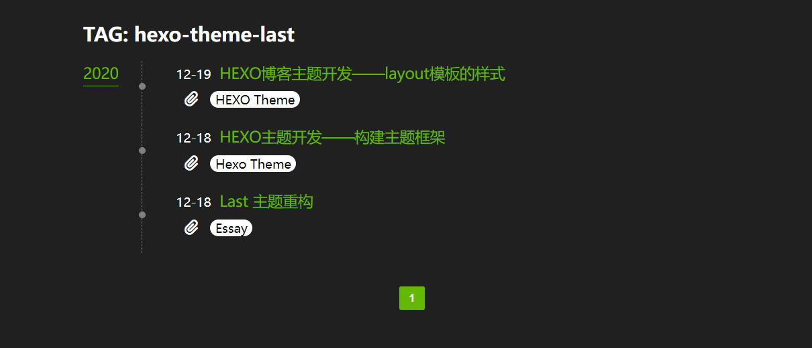
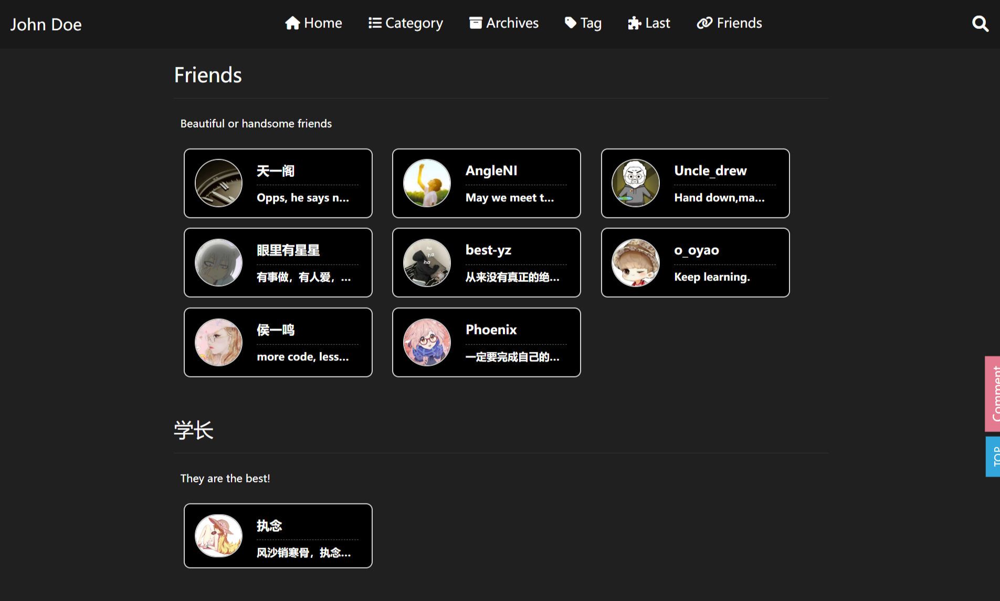
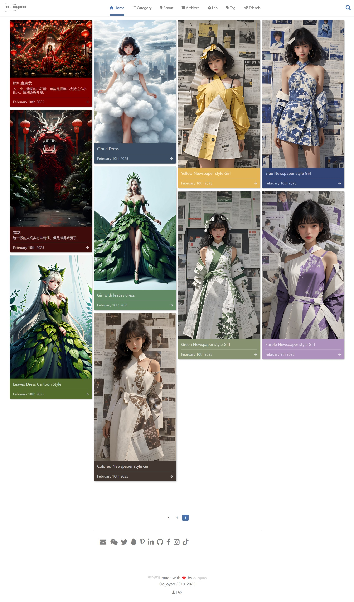

首先，使用hexo自带的命令`hexo new page "page name"`创建新页面

## Archive页面

这个页面是不用创建就自带的。


```yml
archiveStyle:
  style: normal
  type: center # basic, split, center
  color: pink
```
**`style`样式**：comment-shape、normal

=== "normal"

	
=== "comment-shape"
	

**`type`结构**：basic、split、center
=== "center"
	
=== "split"
	
=== "basic"
	


## Tags，Categories页面

需要创建名为`tags`的页面

```
hexo new page tags
```

### 预览

=== "总页面"

    

=== "分类"

    

=== "标签"

    

## 友链接

创建友链接页面

``` bash
hexo new page links
```

如何添加友链接

1. 找到`/source/links/index.md`

2. 在=== ===包裹的段落里面添加一条

   ```markdown
   links:
     - group_name: Friends
       description: Beautiful or handsome friends
       items:
       - url: https://
         img: https://
         name: XXX
         description: Opps, he says nothing.
   ```

   - `group_name`表示对链接进行分组
   - `description`是每一个分组的描述
   - `items`里面具体是一条一条的友链接
     - 每一条友链接有四个信息：网站地址，头像地址，网站名称， 网站描述
     - 每一条连接都以一个`-`开头，格式如上

**注意：里面的看起来像是tabs的缩进，其实是空格，而且必须是空格**



## 图集

图集页面就是普通的categories页面，所以一个图集就是一个普通的post文件。

无需配置额外的页面，只需给顶部菜单配置一个访问的按钮即可，路径则需填写`/categories/Gallery` 才可以正常生效

```yml
xxx:
  path: /categories/Gallery
  ico: ico-name
```

还需要在文件头部进行以下配置：

```yml
title: xxxx
date: xxxx-xx-11 04:39:38
layout: gallery
tags: 
categories: Gallery
cover: https://cdn.jsdelivr.net/gh/DyingDown/img-host-repo/AI/202502110542366.png
color: 8b9238
```

- `layout: gallery` 添加这一条，可以在首页过滤相册展示
- `categories: Gallery` 大小写敏感，给该文件分类到

- `cover:` 每个图集的封面图片，输入图片的地址
- `color: `每个图集展示的背景颜色（在album

页面预览

